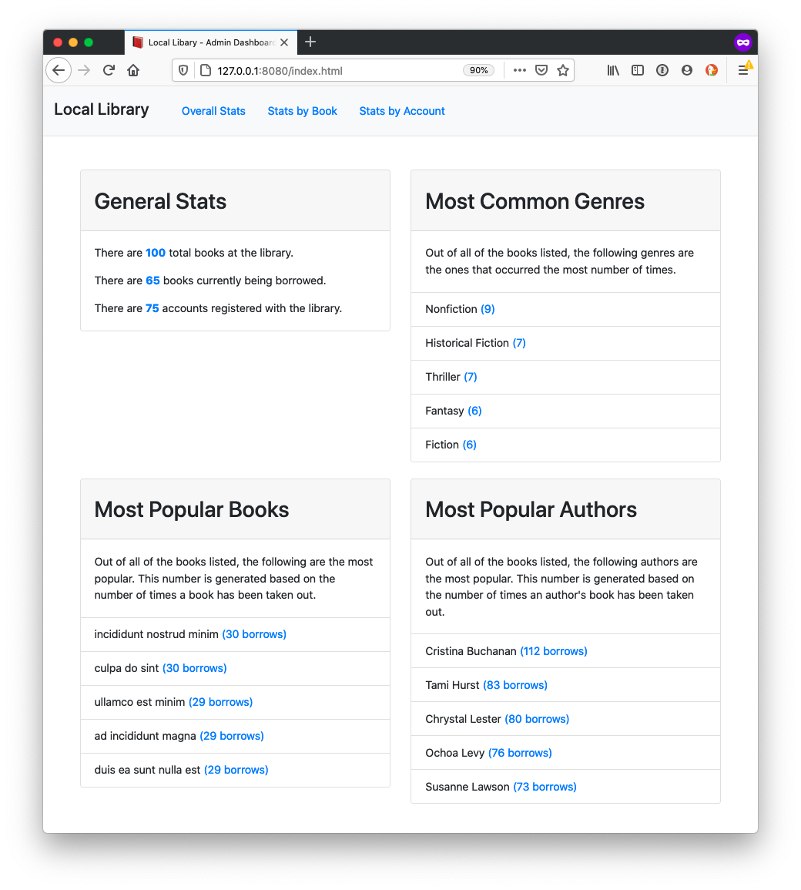

# Local Library Mockup

In this hypothetical project, I built an algorithm to help a neighborhood library. One of the most important features needed to organize this is a dashboard that will show which books are available, which are currently out, and other general statistics about the program. My responsibility was to create an algorithm that listed these criteria in an easily-readible format. 

## Technology Used:
* Bootstrap
* JavaScript

